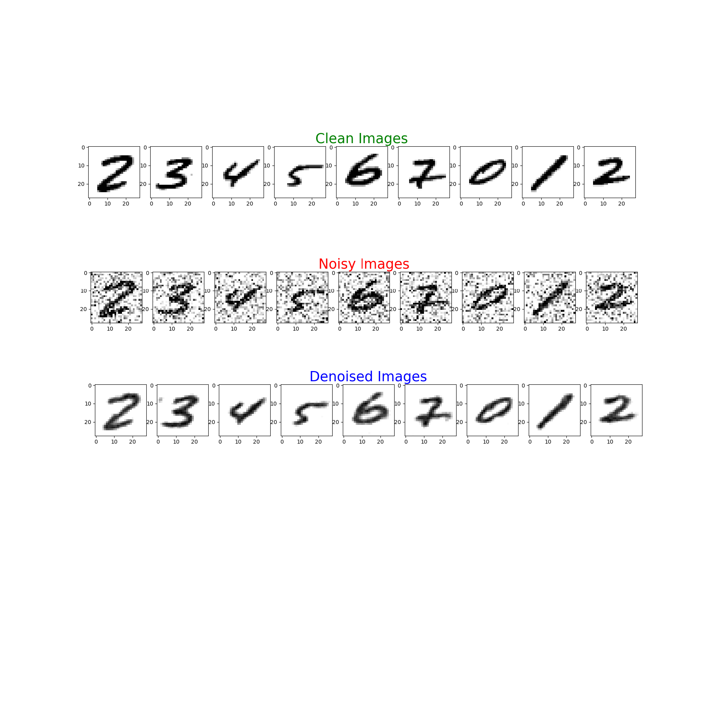

# denoising_handwritten_digits

An **autoencoder** is a type of artificial neural network used to learn efficient data codings in an unsupervised manner. The aim of an autoencoder is to learn a representation (encoding) for a set of data, typically for dimensionality reduction, by training the network to ignore signal “noise”. It has an internal (hidden) layer that describes a code used to represent the input, and it is constituted by two main parts: an encoder that maps the input into the code, and a decoder that maps the code to a reconstruction of the original input. The dimension of input is same as the dimension of the output.

A **Denoising Autoencoder** is a modification on the autoencoder. Here, we fed our autoencoder with the noise images and train the with their correspoinding non noised images, then it can just learn the data.The encoder network reduced the dimension of the noised image, this is called code then this code is fed to the decoder where it denoised the reduced noised images.

The result of the autoencoder can be seen in the image below:

